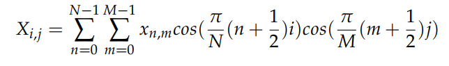

### Transforms for Image Compression: The Discrete Cosine Transform

When it comes to image compression, the DFT isn't ideal. It involves a lot of complex numbers, which can be tricky to represent, and it often isn't the most efficient at representing data, for reasons we will see later. However, fortunately there's a transform that's better suited for compression. The Discrete Cosine Transform is a transform in the Fourier family of transforms - that is, it involves the projection of a signal onto a number of sinusoidal basis vectors, except now the basis vectors are cosine waves instead of complex exponentials as in the DFT.  

#### Properties of the Discrete Cosine Transform

The DCT has a number of properties which differentiate it from the DFT. The first property is fairly noticeable, if we look at the definition of the DCT:

we can see that the DCT only uses cosine waves, and thus the output of the DCT is always real. Other properties of the DCT have important implications for how and where it's used. The first is related to properties of signals that the DCT is usually applied to. Real-world signals tend to be "pink" in nature, meaning that the power of a signal is proportional to *1/frequency*. The DCT has high energy compaction, which means that low-frequency content of a signal is highly concentrated together in a few terms. This is useful for most real-world signals, as it means that most of the power of the signal will be concentrated in the first few terms of the DCT.

Another important property of DCTs - and how they relate to DFTs - is their *edge behavior*. Because these transforms turn signals into sums of exponentials, which are defined for the set of real numbers, these transforms imply an extension of the original signal infinitely in the time domain. However, different transforms handle this extension differently; the DFT simply repeats the original signal infinitely, whereas the DCT is "even" at boundaries, meaning that anything past the boundaries of the signal is just a reflection of the signal (there are other types of DCTs that are "odd", but we focus on a DCT that is even).

Observe that in the DFT, a signal with a very different starting and ending value has a large jump - or *boundary discontinuity* - at the edges of the original. This results in a lot of high frequencies showing up to compensate for this discontinuity. However, in the DCT, there is no discontinuity at boundaries, and thus fewer high frequencies showing up, making it more advantageous for transforming image data, which may have very different edge values.

#### 2D DCTs of Images

In order to get the image processing benefits of the DCT, we must be able to take DCTs of 2D signals such as images. Fortunately, the DCT of a 2D signal can be taken fairly easily, in a manner similar to a 2D DFT. In the 2D DCT, the constant component of the data is in the top left, with frequency increasing down and to the right.

We mentioned earlier that in the DCT, most of the information is concentrated in a few low frequencies. This can be seen in the above figure; the highest DCT coefficients (which are the brightest pixels) are in the top-left of the DCT matrix, which correspond to the low-frequency components of the DCT.
