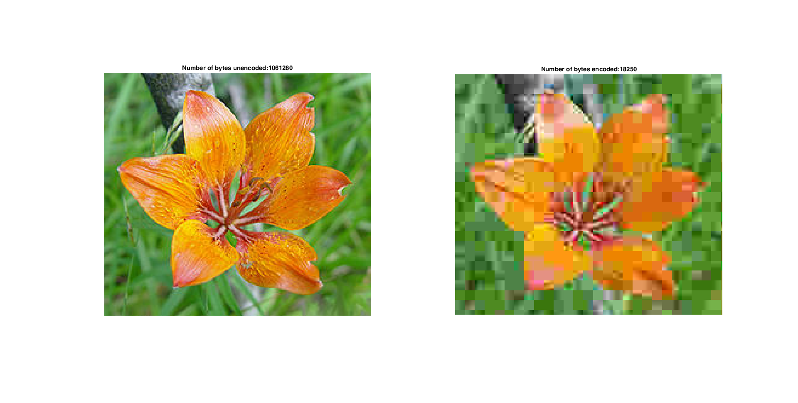
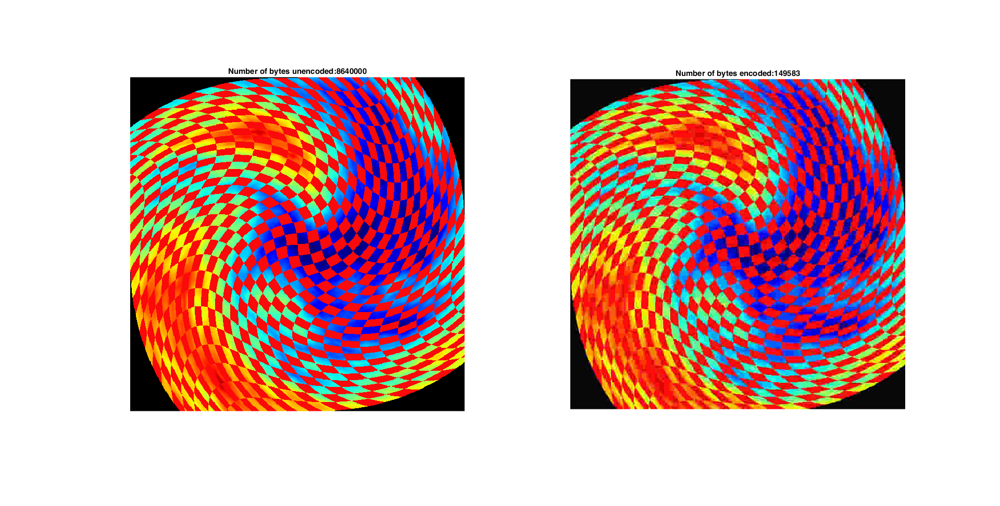
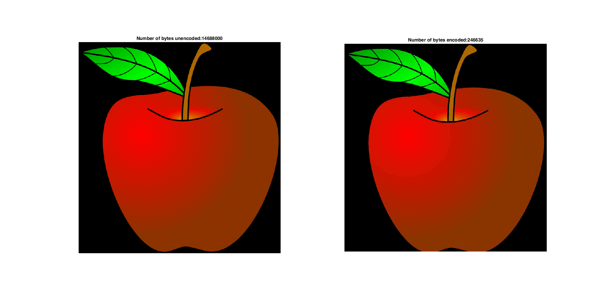

# JPEG Compression Results
Through our implementation, we discovered that based on the quality we want after decoding we can choose on what scale the image is compressed.

### The results of our project are summarized in the following images:

These two sets of images have a high compression so a low final image quality.

These images have a lower comperession but a better final image quality.

