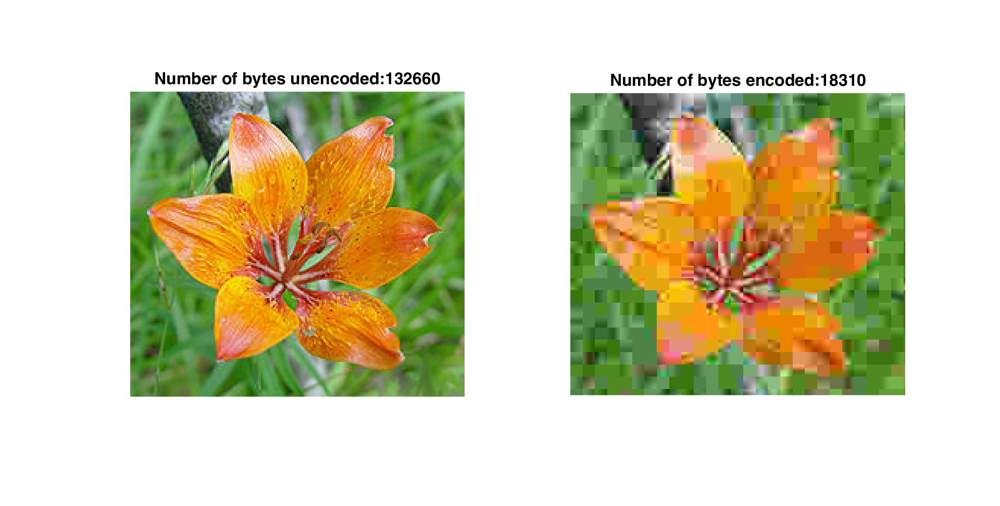
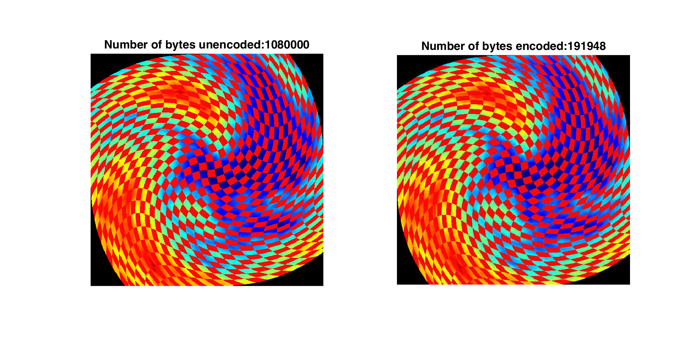
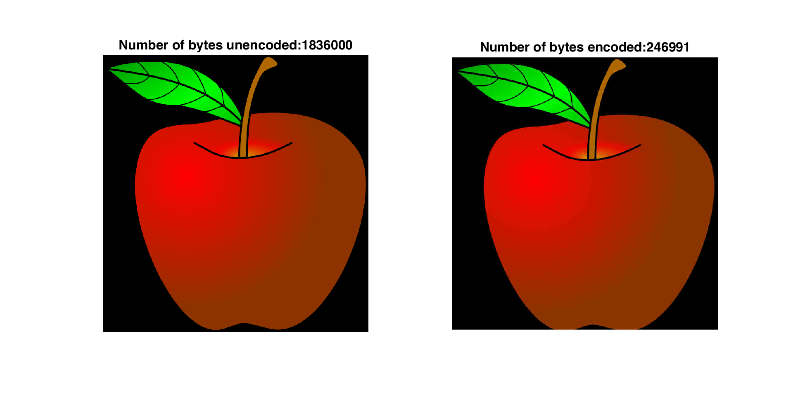

# JPEG Compression Results
Once we implemented JPEG compression, we tested the efficiency of our compression on a number of images. Through the course of our implementation, we discovered that based on the quality we want after decoding we can choose the amount by which the image is compressed. Thus, by making lower-quality (i.e. "lossier") images, we can save even more space. This compression quality can be controlled by simply dividing each entry in the quantization by a certain quality coefficient in the range [0,1], so a coefficient of 0.1. gives 10% quality.

### The results of our project are summarized in the following images:

These two sets of images have a high compression so a low final image quality. Both images were compressed at 10% quality.

##### 7X compression

##### 6X compression

This image was compressed at 50% quality. Note that even at 50% quality we get a very high level of compression, although there are noticeable differences in how the color of the apple is represented.
##### 7X compression

